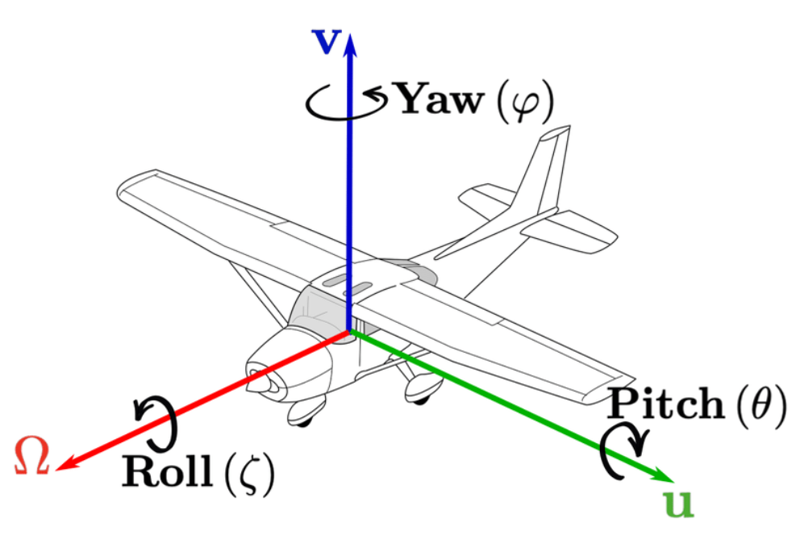
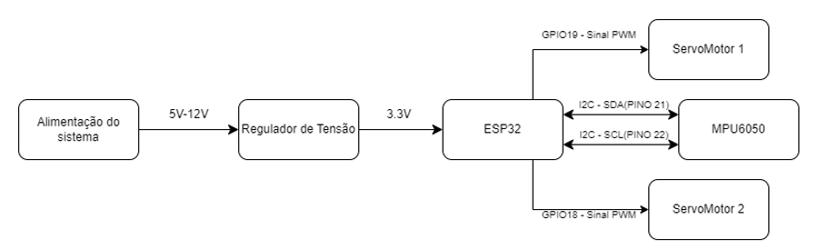
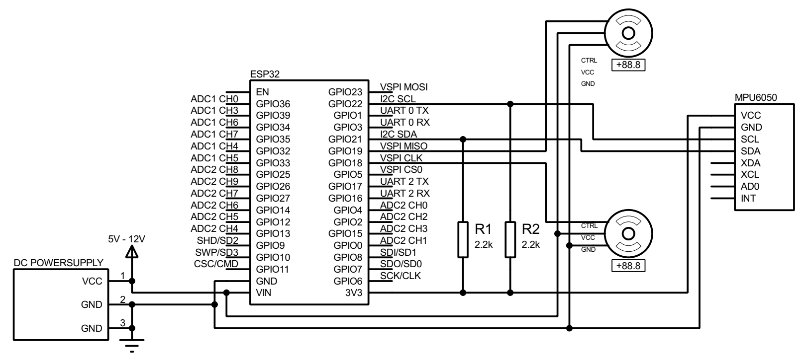
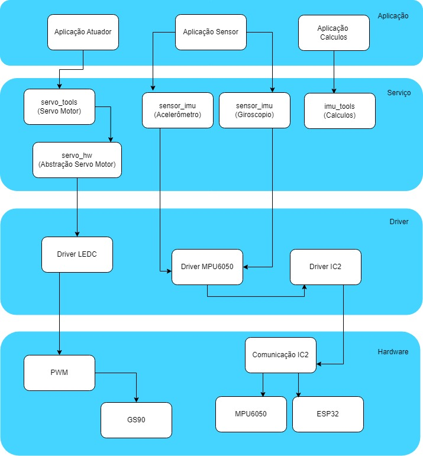
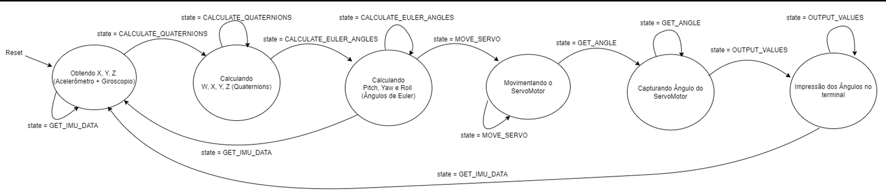
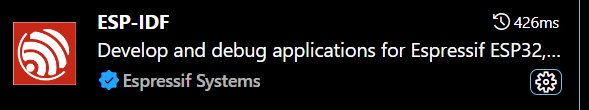
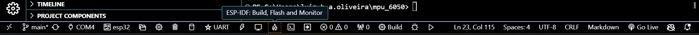

| Placas suportadas | ESP32 | ESP32-C2 | ESP32-C3 | ESP32-C6 | ESP32-H2 | ESP32-S2 | ESP32-S3 |
| ----------------- | ----- | -------- | -------- | -------- | -------- | -------- | -------- |
# Descrição do projeto
Neste repositório foi desenvolvido um projeto para controlar dois servo motores através do sensor MPU6050, um dos servos representando o ângulo roll e outro o ângulo pitch.



**Abaixo temos a descrição das bibliotecas utilizadas:**

## Sensor_imu 

Na biblioteca **sensor_imu** temos a parte de configuração e captura dos dados do giroscópio e acelerômetro do módulo MPU6050.

Estruturas:

```
■ AccelerationData: Guarda os dados do acelerômetro.

■ GyroscopeData: Guarda os dados do giroscópio.
```

Funções:

```
■ imu_init(): Configura a comunicação I2C e inicializa o MPU6050 para se preparar para a captura de dados.

■ get_acceleration_data(AccelerationData *data): Retorna
os dados de aceleração ao longo dos eixos x, y e z.

■ get_gyroscope_data(GyroscopeData *data): Retorna os
dados do giroscópio ao longo dos eixos x, y e z.
```
## Imu_tools
Estruturas:

```
■ IMUData: Guarda os dados do acelerômetro + giroscópio.

■ Quaternion: Guarda os quatro quaternions calculados.

■ EulerAngle: Guarda os angulos de Euler calculados.
```

Funções:

```
■ get_imu_data(IMUData *data): Obtém os dados do
acelerômetro e do giroscópio e os armazena na estrutura IMUData.

■ calculate_quaternion(const IMUData *data, Quaternion
*quaternion): Calcula o quaternion a partir dos dados
armazenados em IMUData.

■ quaternion_to_euler(const Quaternion *quaternion,
EulerAngle *euler): Converte o quaternion em ângulos de Euler(guinada, inclinação e rotação).

■ get_quaternion(Quaternion *quaternion): Obtém o
quaternion calculado e o armazena na estrutura especificada.
```


## Servo_hw
A biblioteca **servo_hw** Fornece uma interface de baixo nível para configurar e controlar servos usando ESP32 PWM.

Configuração:  

```
■ ServoConfig: Define parâmetros como ângulo máximo, largura de pulso mínima e máxima, frequência PWM, canal LEDC, ciclo de trabalho e pino do servo.

■ ServoAngle: Armazena o ângulo atual do servo.
```

Funções:
```
■ hw_servo_init(uint8_t gpio_num): Inicializa o servo configurando o PWM no pino especificado.

■ hw_servo_set_pulse_width(uint8_t gpio_num, uint32_t pulse_width_us): Define a largura do pulso PWM para controlar a posição do servo.

■ hw_servo_deinit(uint8_t gpio_num): Desativa o servo e desabilita o PWM no pino especificado.
``` 

## Servo_tools
A biblioteca **servo_tools** é complementar a biblioteca SERVO_HW com funções adicionais para inicialização e controle de ângulo do servo.

```
■ servo_init(ServoConfig *config): Inicializa o servo usando as configurações especificadas na estrutura ServoConfig.

■ servo_set_angle(ServoConfig *config, ServoAngle angle): Define o ângulo do servo com base na estrutura ServoAngle.

■ servo_get_angle(const ServoConfig *config, ServoAngle *angle): Obtém o ângulo atual do servo e o armazena na estrutura ServoAngle.
```


# Diagrama de blocos
  

# Esquemático

> [!WARNING]  
> Apesar do regulador de tensão do ESP32 trabalhar em um range de 5 - 12 V, para esse projeto não vamos poder ultrapassar os 6V pois o pino VIN usado para alimentar os servos, utiliza a tensão de entrada da placa sem passar pelo regulador. Foi optado utilizar esse pino pois os servos estão consumindo cerca de 150 mA ao movimentar, e como os pinos da ESP32 aceitam no maximo 40mA de consumo, certamenta iria danificar os pinos do microcontrolador.




# Diagrama de arquitetura


# Videos Explicando as Bibliotecas
***[Video Explicativo - Entrega 01 - MPU6050 - Sistemas Embarcados [Youtube]](https://www.youtube.com/watch?v=z6EThjjiCBM)***


***[Video Explicativo - Entrega 02 - Servo - Sistemas Embarcados [Youtube]](https://www.youtube.com/watch?v=dHcb04kcQVU)***

# Video mostrando funcionamento do circuito

***[Demonstração do projeto Servo-Axis-Control [Youtube]](https://youtube.com/shorts/DxNH4GY1BXM?feature=share)***

# Máquina de estados


# Como rodar o projeto
Faça o download da extensão abaixo no VSCode
  

Após baixar com sucesso deverá aparecer o menu abaixo daí é só clicar no ícone "ESP-IDF: Build, Flash and Monitor"  




